  

 

Somos una agencia de IA y tecnología. Diseñamos y construimos arquitecturas operativas a medida para negocios en crecimiento: agentes de IA, automatizaciones y datos conectados en un solo sistema, en lugar de herramientas sueltas.

## Qué construimos

- Agentes de IA para atención, ventas y soporte, sobre WhatsApp e integrados al CRM.
- Automatización de procesos entre las herramientas que el negocio ya usa.
- Dashboards para decidir con datos.
- Sistemas completos para salud, restaurantes, founders B2B, contables, inmobiliarias, e-commerce y comercio.

## Cómo trabajamos

Sin atajos. Sin sorpresas.

## Cuatro reglas

- **Libertad absoluta.** El sistema y los datos viven en las cuentas del cliente. Sin lock-in.
- **A medida.** Se diseña sobre la operación real, no desde un catálogo.
- **Acompañamiento real.** Hablás con quien construye, no con un ticket.
- **Arquitectura integral.** Un sistema coherente, no herramientas sueltas.

 

Fundada por [Santiago Sanabria](https://github.com/santiago-sanabria-craft) · [mantlecorelabs.com](https://mantlecorelabs.com)

  

